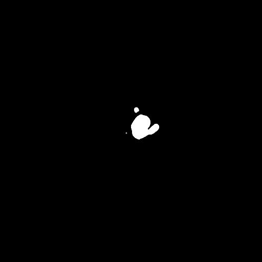

# Pix2pixHD Multi-task Generative Learning
To reduce the exposure of Gadolinium-based Contrast Agents (GBCAs) in brainstem glioma detection and provide high-resolution contrast information,
we propose a novel multi-task generative network for contrast-enhanced T1-weight MR synthesis on brainstem glioma images. The proposed network
can simultaneously synthesize the high-resolution contrast-enhanced image and the segmentation mask of brainstem glioma lesions. <br><br>

A multi-task generative network for simultaneous post-contrast MR image synthesis and tumor
segmentation: application to brainstem glioma

[Yajing Zhang]<sup>1</sup>, [Xiangyu Xiong]<sup>1</sup>, [Yaou Zhu]<sup>2</sup>
 
<sup>1</sup>MR Clinical Science, Philips Healthcare, Suzhou, China, <sup>2</sup> Department of Radiology, Beijing Tiantan Hospital, Capital Medical University, Beijing, China

## Image-to-image translation at 512x512 resolution

- {T1, T2, ASL}-to-{T1ce, tumor mask}
<p align='center'>
  
  
  
  
  
</p>
<p align='center'>
  
  
  
  
  
</p>

## Prerequisites
- Linux or Windows
- Python 3
- NVIDIA GPU (11G memory or larger) + CUDA cuDNN

## Getting Started
### Installation
- Install PyTorch and dependencies from http://pytorch.org
- Install python libraries [dominate](https://github.com/Knio/dominate).
```bash
pip install dominate
```
- Clone this repo:
```bash
git clone https://github.com/yXiangXiong/Multi-task_Generative_Synthesis_Network
cd pix2pixHD_Multi-task_Learning
```


### Testing
- Test the model (`bash ./scripts/test_1024p.sh`):
```bash
#!./scripts/test.sh
python test.py --dataroot F:\xiongxiangyu\pix2pixHD_Mask_Data --name NC2C --label_nc 0 --input_nc 9 --output_nc 6 --resize_or_crop none --gpu_ids 0 --which_epoch 200 --no_instance --how_many 144
```
The test results will be saved to a html file here: `./results/NC2C/test_latest/index.html`.

More example scripts can be found in the `scripts` directory.

### Training
- Train a model at 512 x 512 resolution (`bash ./scripts/train_512p.sh`):
```bash
#!./scripts/train.sh
python train.py --dataroot F:\xiongxiangyu\pix2pixHD_Mask_Data --name NC2C --label_nc 0 --input_nc 9 --output_nc 6 --netG global --resize_or_crop none --gpu_ids 0 --batchSize 1 --no_instance
```
- To view training results, please checkout intermediate results in `./checkpoints/NC2C/web/index.html`.
If you have tensorflow installed, you can see tensorboard logs in `./checkpoints/NC2C/logs` by adding `--tf_log` to the training scripts.

### Multi-GPU training
- Train a model using multiple GPUs (`bash ./scripts/train_512p_multigpu.sh`):
```bash
#!./scripts/train_512p_multigpu.sh
python train.py --name label2city_512p --batchSize 8 --gpu_ids 0,1,2,3,4,5,6,7
```
Note: this is not tested and we trained our model using single GPU only. Please use at your own discretion.

### Training at full resolution
- To train the images at full resolution (2048 x 1024) requires a GPU with 24G memory (`bash ./scripts/train_1024p_24G.sh`), or 16G memory if using mixed precision (AMP).
- If only GPUs with 12G memory are available, please use the 12G script (`bash ./scripts/train_1024p_12G.sh`), which will crop the images during training. Performance is not guaranteed using this script.

### Training with your own dataset
- If you want to train with your own dataset, please generate label maps which are one-channel whose pixel values correspond to the object labels (i.e. 0,1,...,N-1, where N is the number of labels). This is because we need to generate one-hot vectors from the label maps. Please also specity `--label_nc N` during both training and testing.
- If your input is not a label map, please just specify `--label_nc 0` which will directly use the RGB colors as input. The folders should then be named `train_A`, `train_B` instead of `train_label`, `train_img`, where the goal is to translate images from A to B.
- If you don't have instance maps or don't want to use them, please specify `--no_instance`.
- The default setting for preprocessing is `scale_width`, which will scale the width of all training images to `opt.loadSize` (1024) while keeping the aspect ratio. If you want a different setting, please change it by using the `--resize_or_crop` option. For example, `scale_width_and_crop` first resizes the image to have width `opt.loadSize` and then does random cropping of size `(opt.fineSize, opt.fineSize)`. `crop` skips the resizing step and only performs random cropping. If you don't want any preprocessing, please specify `none`, which will do nothing other than making sure the image is divisible by 32.

## More Training/Test Details
- Flags: see `options/train_options.py` and `options/base_options.py` for all the training flags; see `options/test_options.py` and `options/base_options.py` for all the test flags.
- Instance map: we take in both label maps and instance maps as input. If you don't want to use instance maps, please specify the flag `--no_instance`.
- models: see 'pix2pixHD_model.py ' to modify the loss functions
- models: see 'networks.py ' to modify the global generator and discriminator
- options: change the arguments


## Citation

If you find this useful for your research, please use the following.

## Acknowledgments
This code borrows heavily from [pix2pixHD](https://github.com/NVIDIA/pix2pixHD).
